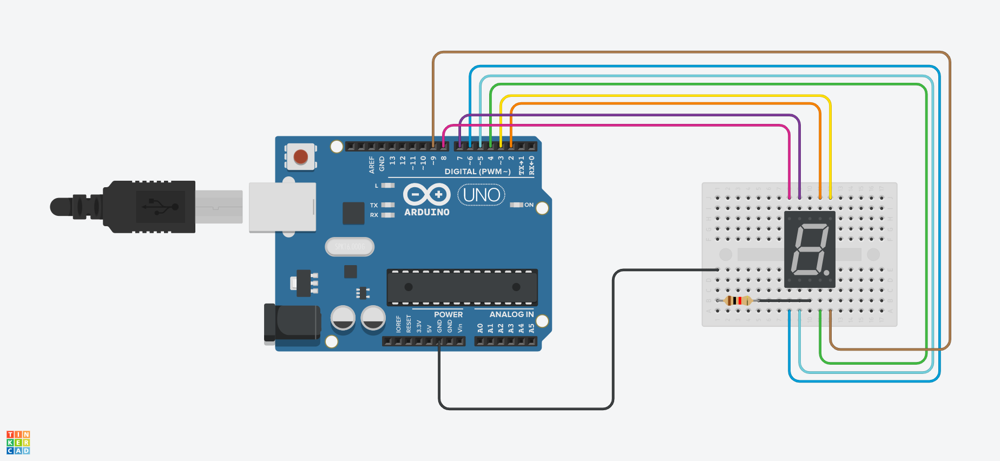

# Arduino 7 segments display counter

An Arduino UNO connected to a Cathode 7 Segment Display. Once it starts, it will show the numbers from 0 to 9

# Components

* 1 Arduino Uno R3
* 1 Cathode 7 Segment Display
* 1 Resistors 330Ω

# Circuit

Once the circuit is turned on, it will show in the display the numbers from 0 to 9 in an infinite loop.

# Code

The code for Arduino can be found in the `src` directory. It's just a single file written in `C`.

# Simulation

[watch how it works in tinkercad](https://www.tinkercad.com/things/f7kjUjaAmvP)

